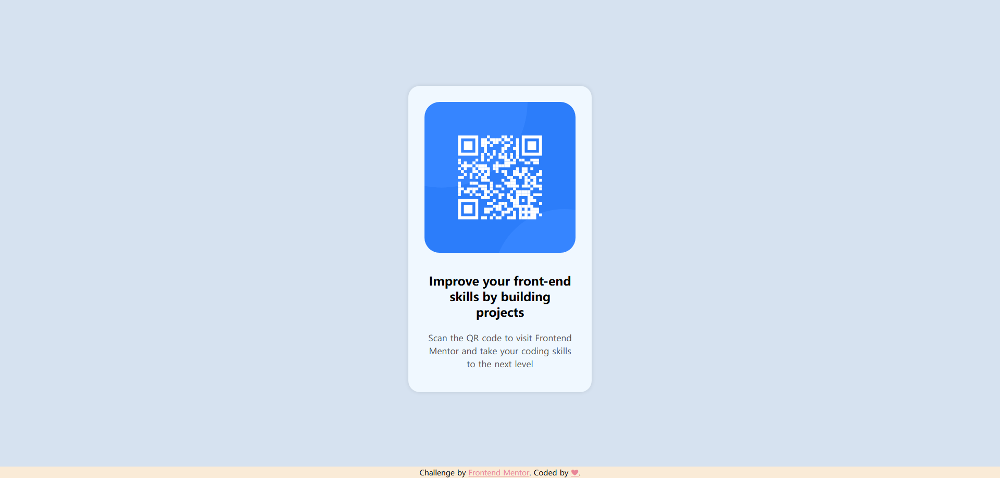

# Frontend Mentor - QR code component solution

This is a solution to the [QR code component challenge on Frontend Mentor](https://www.frontendmentor.io/challenges/qr-code-component-iux_sIO_H). Frontend Mentor challenges help you improve your coding skills by building realistic projects. 

## Overview

### Screenshot

### Links

- Solution URL: [https://github.com/shinechn/qr-code-component](https://github.com/shinechn/qr-code-component)
- Live Site URL: [https://shinechn.github.io/qr-code-component/](https://shinechn.github.io/qr-code-component/)

## My process

### Built with

- Semantic HTML5 markup
- CSS custom properties
- Flexbox

### What I learned

- why you need use `*` and `body` as css selector at the same time.

- why you need creat parent `
`

- how to design a Layout, make contents center.

### Useful resources

- [https://codepen.io/enucar/pen/bGYNNaY](https://codepen.io/enucar/pen/bGYNNaY) - This helped me for how to use css style.

